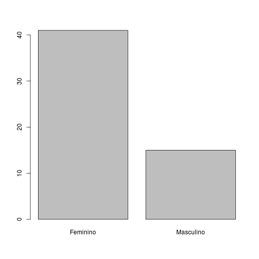
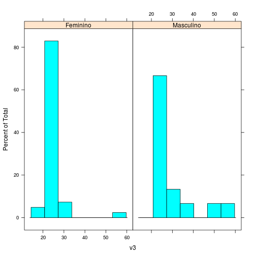
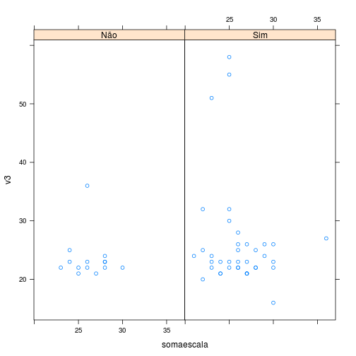
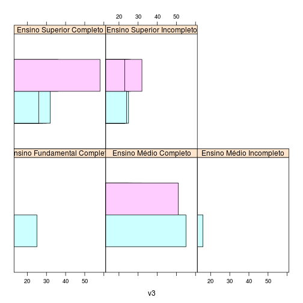
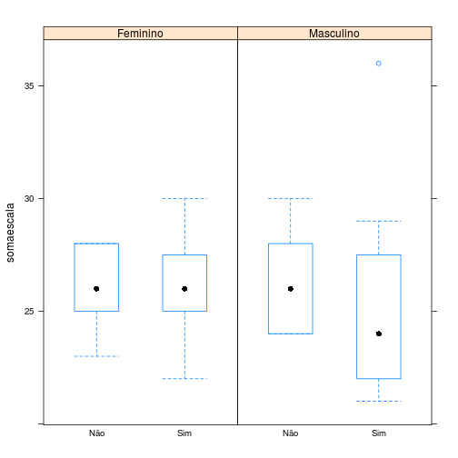
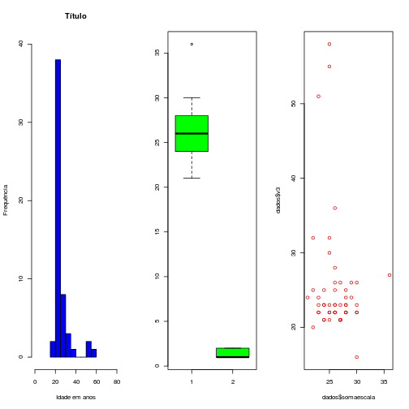

## Antes de começar
Downloads
* [Banco de dados](https://www.dropbox.com/s/yg5ah2au41zoeun/autoestima.csv) - https://www.dropbox.com/s/yg5ah2au41zoeun/autoestima.csv
* [Descrição do banco](https://www.dropbox.com/s/2lccmbyqyscdn30/descricao-banco-auto-estima.pdf) - https://www.dropbox.com/s/2lccmbyqyscdn30/descricao-banco-auto-estima.pdf

---

## Carregando o banco da aula e pacotes


```
dados  <- read.csv(file.choose(), header=TRUE, sep=",")
require(ggplot2)
require(lattice)
```

---

## Uma imagem vale mais que mil palavras...

1. Introdução ao gráficos no R
2. Histogramas
3. Gráficos de dispersão
4. Gráficos de barra
5. Boxplot

---

## Exemplo

<center>

</center>
[Fonte](http://blog.revolutionanalytics.com/2010/12/details-on-the-r-facebook-graph.html)

---

## Introdução
* Existem três pacotes principais para fazer gráficos: base, lattice e ggplot2
* PQP eles são diferentes! No entanto, existem alguns parâmetros em comum!

---

## Base e Lattice
* Base - simples e mais fácil de usar. Bom para visualizar poucas variáveis
* Lattice - feito para explorar relações mais complexas dos dados.

---

## Histogramas

```r
hist(dados$v3)
```

 


---

## Gráficos de dispersão

```r
plot(dados$v3, dados$somaescala)
```

 


---

## Gráficos de barra

```r
graphBar <- table(dados$v6)
barplot(graphBar)
```

 


---

## Boxplot

```r
boxplot(dados$somaescala ~ dados$v9)
```

 


---

## Lattice
* Formato típico
```
tipodegrafico(formula, data = nome do banco de dados)
```
A fórmula especifica o valor e os fatores para visualização. Exemplos:
* ~ x | a - especifica a variável x para os fatores a (idade por gênero)
* x ~ y | a*b - especifica a relação entre númericas x e y para as combinações dos fatores a e b (soma da escala por idade para gênero divido por religião)

---

## Histogramas

```r
histogram(~v3 | v6, data = dados)
```

 


---

## Gráficos de dispersão

```r
xyplot(v3 ~ somaescala | v9, data = dados)
```

 


---

## Gráficos de barra

```r
barchart(~v3 | v8, groups = v6, data = dados)
```

 


---

## Boxplot

```r
bwplot(somaescala ~ v9 | v6, data = dados)
```

 


---

## título no gráfico- main
Um exemplo: histogramas

```r
hist(dados$somaescala, main = "Título")
```

 


---

## rótulos dos eixos no gráfico- xlab e ylab

```r
hist(dados$v3, main = "Título", xlab = "Idade em anos", ylab = "Frequência")
```

 


---

## limite dos eixos - xlab e ylab

```r
hist(dados$v3, main = "Título", xlab = "Idade em anos", ylab = "Frequência", 
    xlim = c(0, 80), ylim = c(0, 40))
```

 


---

## cores - col
Você pode especificar cores através de index, names e hexadecimal. Aqui tem um [guia](http://www.statmethods.net/advgraphs/parameters.html)
```
par(mfrow=c(1,3))
hist(dados$v3, main="Título", xlab="Idade em anos", ylab="Frequência", xlim=c(0,80), ylim=c(0,40), col="blue")
boxplot(dados$somaescala, dados$v6, col = "green")
plot(dados$somaescala, dados$v3, col = "red")
par(mfrow=c(1,1))
```

---

## cores - col
 

---

## Referências
Dicas de gráficos - http://www.statmethods.net/advgraphs/parameters.html
Galeria de gráficos em R - http://www.sr.bham.ac.uk/~ajrs/R/r-gallery.html

---
