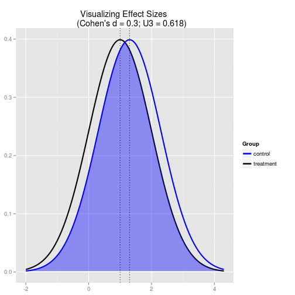
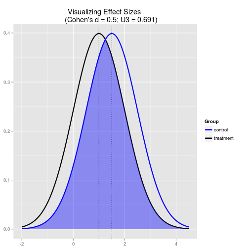
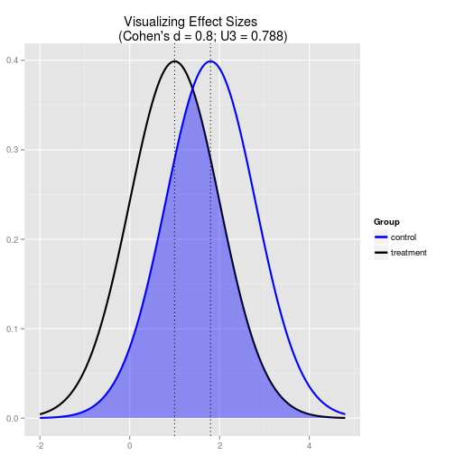

## Antes de começar
Downloads
* [Banco de dados](https://www.dropbox.com/s/yg5ah2au41zoeun/autoestima.csv) - https://www.dropbox.com/s/yg5ah2au41zoeun/autoestima.csv
* [Descrição do banco](https://www.dropbox.com/s/2lccmbyqyscdn30/descricao-banco-auto-estima.pdf) - https://www.dropbox.com/s/2lccmbyqyscdn30/descricao-banco-auto-estima.pdf

---

## Carregando o banco da aula e pacotes


```
dados  <- read.csv(file.choose(), header=TRUE, sep=",")
library(epicalc) # Funções utéis para epidemiologia
```

---

## Resumão

* O mantra p < 0,05
* Alfa, Beta e Poder
* Amostragem
* Significância estatítica vs clínica
* Exemplo discutido

---

## Significância estatística vs clínica

* Significância estatística não é a mesma coisa que a clínica!
* Um bom estudo deve ter bem definido a diferença clínica que se quer observar

---

## Meu querido p < 0,05 (alfa)

* O valor p do teste significa a probabilidade de rejeitar Ho quando ela é de fato verdadeira.
* É o valor geralmente adotado pelas publicações, embora por si só não queira dizer muita coisa.

---

## Alfa, Beta, Poder

* Alfa é a probabilidade de falhar em rejeitar Ho quando ele é de fato verdadeiro
* Beta é a probabiildade de falhar em rejeitar Ho quando ele é de fato falso
* Poder é 1-beta
* Estes paramêtros são importantes em determinar o tamanho de sua amostra e o tamanho da diferença que o teste estatístico pode detectar.

---

## Tamanhos de efeito

* É o tamanho da variabilidade da variável dependente que pode ser atribuída a variável independente (Cohen, 1992).
* Pode ser convertido em índice, "d de Cohen". Efeito pequeno (d = 0.3), médio (d = 0.5), grande (d = 0.8).
* Recomendação da APA para descrever o tamanho do efeito das análises realizadas.
* São utilizados para determinar tamanhos de amostras com outros indicadores como o alfa e beta.

---

## Tamanhos de efeito - pequeno


```r
cohen.d(0.3)  # pequeno
```

 


---

## Tamanhos de efeito - médio


```r
cohen.d(0.5)  # médio
```

 


---

## Tamanhos de efeito - grande


```r
cohen.d(0.8)  # grande
```

 


---

## Poder - O pacote pwr

* O pacote permite o cálculo de poder de testes utilizados como:
  - teste t
  - anova
  - qui-quadrado
  - correlação simples
  - modelos lineares

---

## Amostragem

Para realizar amostragem (ou pedir para alguém fazê-la):
  * Defina seu problema de pesquisa e suas hipotéses
  * Defina as medidas que serão utilizadas e a diferença clínica esperada
  * Defina seu beta, alpha e o tamanho de efeito esperado
  * Corra a um estatístico ou arrisque a sorte com o pacote "epicalc"

---

## Exemplo discutido

Um pesquisador quer saber se um treinamento de "leitura dinâmica" aumenta a velocidade média de leitura de palavras. 
* Tarefa: ler os sertões de Euclides da cunha
* Medida: avaliar o tempo médio de leitura em horas
* Grupo controle vs grupo "leitura dinâmica"

---

## Exemplo discutido (Cont.)

* Alfa = 0.05
* Poder = 0.80
* Diferença entre médias esperada = 30 minutos (1/2 hora)
* Qual o n necessário para esta diferença ser estatisticamente significafiva?

---

## Amostragem - "epicalc"

Diversas funções para amostragem
  * survey
  * médias
  * proporções
  ...

---

## Uso da função n.for.2means


```r
n.for.2means(mu1 = 12, mu2 = 11.5, sd1 = 1, sd = 1, alpha = 0.05, power = 0.8)
```

```
## 
## Estimation of sample size for testing Ho: mu1==mu2 
## Assumptions: 
##  
##      alpha = 0.05 
##      power = 0.8 
##      n2/n1 = 1 
##        mu1 = 12 
##        mu2 = 11.5 
##        sd1 = 1 
##        sd2 = 1 
##  
## Estimated required sample size: 
##  
##         n1 = 64 
##         n2 = 64 
##    n1 + n2 = 128 
## 
```


---

## Comparação entre grupos


```r
set.seed(1)  # controlando a randomização
grupoE <- rnorm(n = 64, mean = 12, sd = 1)  # grupo experimental
grupoC <- rnorm(n = 64, mean = 11.5, sd = 1)  # grupo controle
testeTe <- t.test(grupoE, grupoC, var.equal = TRUE)  # teste t
```


---

## Cálculo do efeito


```r
t <- testeTe$statistic[[1]]
df <- testeTe$parameter[[1]]
r <- sqrt(t^2/(t^2 + df))
round(r, 3)
```

```
## [1] 0.318
```


---

## Referências

* Wright, D. B. (2003). Making friends with your data: Improving how statistics are conducted and  reported. British Journal of Educational Psychology, 73(1), 123.
* Goodwin, C. J. (2010). Research in psychology: methods and design. Hoboken, NJ: Wiley.
* Cohen, J. (1992). A power primer. Psychological bulletin, 112(1), 155.
* Stephane Champely (2012). pwr: Basic functions for power analysis. R package version 1.1.1. http://CRAN.R-project.org/package=pwr

---

## Obrigado


---

