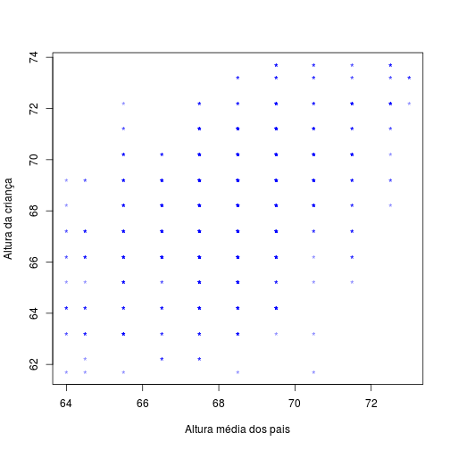

## Antes de começar

Pacote e banco de dados

```
library(psych)
data(galton)
```


---

## Como responder este problema?

* A altura da criança é semelhante a dos seus pais?
* Traduzindo: a altura das crianças possui correlação com a de seus pais?

---

## Covariância

* Variância é uma medida que nos diz o quão dispersa está nossa variável comparada com a média.
* A covariância nos diz se a variação de uma variável A está ligada a uma variável B.
* Não usamos muito porque ela depende da unidade das escalas utilizadas

---

## Coeficiente de correlação

* O coeficiente de correlação é uma medida padronizada da variância.
* Não depende da unidade das escalas utilizadas.

---

## Coeficiente de correlação

* Pode variar de 0 a 1
  * 0 - não existe associação entre as variáveis
  * 1 - existe associação perfeita entre as variáveis
* Pode ser negativo ou positivo
  * negativo - Quanto menor b, maior a prob de b ser maior.
  * positivo - Quanto maior a, maior a prob de b ser maior.

---

## Correlação baixa

r = 0.3


 


---


## Correlação média

r = 0.6

 


---

## Correlação alta

r = 0.9

 


---

## Cuidado!

* O fato de existir correlação nem sempre quer dizer muita coisa. Ex. QI e tamanho do pé
* A causa B ou B causa A?

---

## Exemplo da altura dos pais e crianças


```r
plot(galton$parent, galton$child, xlab = "Altura média dos pais", ylab = "Altura da criança", 
    col = rgb(0, 0, 1, alpha = 0.5), pch = "*")
```

 


---

## Suposições para escolha do teste de correlação

* Variáveis se distribuem normalmente e são númericas?
  * Se sim, usaremos o coeficiente de correlação de Pearson
  * Se não, usaremos o coeficiente de correlação de Spearman ou Kendal

* Uma variável é númerica e outra categórica dicotômica
  * Correlações bi-seriais e ponto-seriais


---

## Função cor.test()

```
cor.test(x, y, method, alternative, ...)
```

* method - "kendall", "pearson" e "kendall"
* alternative - "two.sided", "greater", "less"

---

## As alturas das variáveis são normais?

 


---

## Calcular coeficiente - cor.test()


```r
cor.test(galton$parent, galton$child, alternative = "two.sided", method = "pearson")
```

```
## 
## 	Pearson's product-moment correlation
## 
## data:  galton$parent and galton$child
## t = 15.71, df = 926, p-value < 2.2e-16
## alternative hypothesis: true correlation is not equal to 0
## 95 percent confidence interval:
##  0.4064 0.5081
## sample estimates:
##    cor 
## 0.4588
```


---

## O que é importante observar

* O tamanho do efeito já é o coeficiente de correlação!
* O coeficiente de correlação é igual a 0,45. Um tamanho de efeito moderado.
* O intervalo de confiança para o r da população é de 0,40 a 0,50
* o valor p < 0.001


---

## Para saber mais

Field, A. P., & Miles, J. (2012). Discovering statistics using R. Los Angeles; London: SAGE.

---
