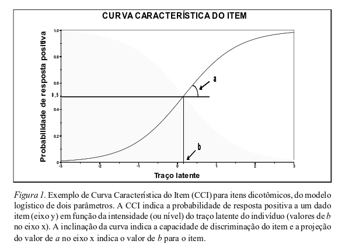

Da Teoria Clássica dos Testes à Teoria de Resposta ao Item
===================================================================================
title: TCT a TRI
author: Henrique Gomide
date: 29/06

Antes de começar
================
* Esta apresentação é feita a partir da leitura do artigo: 
  * Sartes, L. M. A., & Souza-Formigoni, M. L. O. de. (2013). Avanços na Psicometria: Da Teoria Clássica dos Testes à Teoria de Resposta ao Item. Psicologia: Reflexão e Crítica, 26(2), 241–250.

* O material faz parte do conteúdo do blogue - http://grupocrepeia.blogspot.com.br/ 

 Este trabalho é licenciado através da <a rel="license" href="http://creativecommons.org/licenses/by-sa/4.0/">Creative Commons Attribution-ShareAlike 4.0 International License</a>.

Conceitos importantes
=======================

* Validade do instrumento - capacidade de medir aquilo que o instrumento se propõe a avaliar[1]
* Confiabildiade - reprodutibilidade da medida, grau de concordância entre múltiplos sujeitos - Ex. alfa de Cronbach[2];

[1]: Pasquali, 1997
[2]: Portney & Watkins, 1993 

Validade de constructo
========================

* Capacidade do instrumento medir efetivamente o constructo - (processo psicológico ou característica do sujeito[3].

[3]: Bruscato, 1998 

Objetivos
===================

* Apresentar as características das técnicas da Teoria Clássica dos testes,
* Comparar criticamente o uso de ambas na avaliação da validade de constructo e otimização dos instrumentos;

Teoria Clássica dos Testes - TCT
=================================

1. Escore Observado = Valor Real + Erro
2. Valor esperado para o resultado observado é o resultado verdadeiro.

Dificuldade do item
===========================

* Dicotômicos - Proporção de indíviduos que respondem afirmativamente ao item.
* Politômicos - Proporção de respostas a uma categoria ou média das respostas do indivíduo.
* Varia de 0 a 1.

Discriminação
===========================

* Diferenciar o grupo de indivíduos através do escore final.
* Pode separar em dois grupos baseados em uma distância da média. 

Problemas com o índice de dificuldade
=====================================

* Respostas em branco.
* Chute.

Análise fatorial
=====================================

* Avaliar a dimensionalidade do instrumento de medida.
* Permite representar um conjunto de itens em um número menor de dimensões.
* Geralmente dividida entre Exploratória e Confirmatória.

Problemas com a Análise fatorial
=================================

* Estimar o número de fatores adequados
* Instrumentos com diversos tipos de questões - Likert, numérica...
* Linearidade na relação dos itens com o construto.

Limitações da Teorica Clássica dos Testes
==========================================

1. Medidas são dependentes da **amostra dos indivíduos** que responderam ao instrumento.
2. Índices de dificuldade e discriminação variam quando o teste é aplicado no mesmo indivíduo.
3. Testes que avaliam o mesmo constructo não são expressos na mesma escala.
4. Pressuposto que a variância do erro de medida é igual pode ser violada. 

Teoria de Resposta ao Item - TRI
======================================

* O item de um teste avalia um traço latente (constructo).
* A resposta de um item é uma função de probabilidade relacionada ao traço latente.
* Nível de traço latente: gravidade da depressão, habilidade em matemática...

TRI - Continuação
======================================

* Existem diversos modelos para TRI.
* Suposições para maioria dos modelos
   1. Unidimensionalidade*
   2. Independência local

Vantagens da TRI
=======================

1. O cálculo do nível de traço independe da amostra de itens utilizados;
2. O cálculo dos parâmetros independe da amostra dos sujeitos.
3. Permite classificar os itens e sujeitos na mesma escala do traço latente.
4. Não necessita do pressuposto que o erro varia igualmente entre os sujeitos.
5. Não necessita de trabalhar com instrumentos paralelos.

Curva Característica do Item
==============================

(Sartes & Formigoni, 2013)

Características
==============================

* Escalas dos níveis latentes - padronização
* Itens âncoras - usados para caracterizar cada nível do traço latente

Por que ainda não usamos TRI?
==============================

* Formação nos cursos de graduação e pós-graduação em TCT
* Mais difícil de entender
* Tamanho das amostras
* Softwares são mais caros e difíceis de usar

