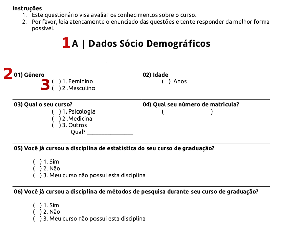

## Alerta

1. Antes de criar seu questionário, procure por um existente. Poupará tempo e reduz o risco de produzir más questões!
2. Criando ou adaptando, teste antes de começar sua pesquisa.

---

## Introdução a um bom questionário

Dicas quanto:
* Conteúdo
* Layout

---

## Conteúdo do questionário

As 4 etapas do processo de resposta

1. Entender a pergunta
2. Encontrar uma resposta adequada
3. Julgar se a resposta satisfaz a pergunta
4. Marcar o questinário

---

## Utilize palavras familiares

Exemplo:

"As pessoas geralmente são condescendentes comigo ou me tratam como criança, só porque tenho problemas com abuso de substâncias."

"Você é ou possui alguém da família que é web-designer ou que faz programas?"

---
 
## Pergunte uma coisa de cada vez

Exemplos:

* "No último ano, você teve convívio direto com algum usuário pesado ou dependente de álcool e outras drogas?"
* "Nos dias em que usava [SUBSTÂNCIA OU A CLASSE DE SUBSTÂNCIAS SELECCIONADA], passava mais de 2 horas tentando conseguir a(s) droga(s), se drogando, ou se recuperando dos efeitos do(a) [SUBSTÂNCIA OU A CLASSE DE SUBSTÂNCIAS SELECCIONADA],  ou ainda pensando nessas coisas?"

---

## Transforme perguntas negativas em afirmativas

Frases afirmativas são mais fáceis de entender que negativas. Exemplo:
* Você não concorda que eu não deva ir ao show?
* Você concorda que eu deva ir ao show?

---

## Agrupe as perguntas de forma lógica

* Nome, e-mail, uso de álcool, mora com mãe, tem sintomas depressivos, tem cachorro.
* Nome, e-mail, mora com a mãe, tem cachorro, uso de álcool, sintomas depressivos.

---

## Cuidado com tabus
[Angolano e o sexo ocasional](https://www.youtube.com/watch?v=8zNnvFoacpQ)

---

## Escreva instruções
* Use palavras familiares de forma familiar. (Ex: frequência de ataques cardíacos e dor de cabeça)
* A voz deve ser ativa e não passiva. Ex. O questionário deve ser respondido pelo participante com um lápis -> Você deve responder o questionário com um lapís.
* Escreva pequenas frases dividas em tópicos.
* Utilize cabeçalhos para organizar o conteúdo
* Pratique o desapego e corte palavras desnecessárias.

---

## Layout
* Divida seu questionário em blocos
* Na web, evite rolagem de páginas. As pessoas não ligam para o que está abaixo da tela!
* Não faça economia porca, utilize de espaços para facilitar a leitura e interpretação das pessoas ao responder seu questionário.

---

## Exemplo

---

## Referências

(Forms na internet)[http://www.formsthatwork.com/]
Goodwin, C. J. (2010). Appendix B - Developing surveys for Research in Psychology. In: Research in psychology: methods and design. Hoboken, NJ: Wiley.

---