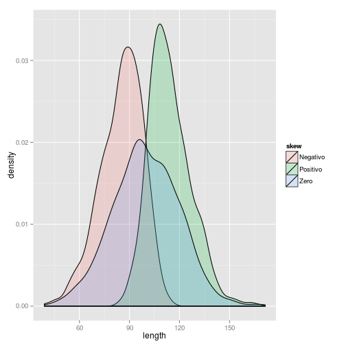

## Antes de começar
Downloads
* [Banco de dados](https://www.dropbox.com/s/yg5ah2au41zoeun/autoestima.csv) - https://www.dropbox.com/s/yg5ah2au41zoeun/autoestima.csv
* [Descrição do banco](https://www.dropbox.com/s/2lccmbyqyscdn30/descricao-banco-auto-estima.pdf) - https://www.dropbox.com/s/2lccmbyqyscdn30/descricao-banco-auto-estima.pdf

---

## Carregando o banco da aula e pacotes


```
dados  <- read.csv(file.choose(), header=TRUE, sep=",")
require(psych)
require(ggplot2)
```

---

## Resumo

1. Média, variância, desvio padrão
2. Mediana, quartis, percentis, distância interquartílica,
3. Funções describe, summary, by 

---

## Medidas de tendência central

* Existem diversas medidas de tendência central
* A medida que melhor representar seu conjunto de dados deve ser escolhida
* A escolha da medida de tendência central influencia a escolha dos testes estatísticos.

---

## Média

* Definida como a soma dos valores de um conjunto de dados pelo número de elementos do conjunto
* Ex: Média de idade dos participantes do banco.

```r
mean(dados$v3, na.rm = TRUE)  # o argumento lógico na.rm = TRUE significa para retirar os casos faltosos no banco.
```

```
## [1] 25.55
```


---

## Desvio padrão
* O desvio padrão é uma medida de dispersão de um conjunto de dados de sua média. Quanto mais dispersos os dados, maior o desvio padrão.

```r
sd(dados$v3, na.rm = TRUE)  # o argumento lógico na.rm = TRUE significa para retirar os casos faltosos no banco.
```

```
## [1] 7.871
```


---

## Variância
* O quadrado do desvio padrão.

```r
var(dados$v3, na.rm = TRUE)  # o argumento na.rm = TRUE significa para retirar os casos faltosos no banco.
```

```
## [1] 61.96
```


---

## Mediana

* A mediana pode ser definida como o valor que divide um conjunto de dados em uma metade inferior e outra superior
* Ex: Mediana de idade dos participantes do banco.

```r
median(dados$v3, na.rm = TRUE)  # o argumento lógico na.rm = TRUE significa para retirar os casos faltosos no banco.
```

```
## [1] 23
```


---

## Quartis e percentis
* Os quartis são os valores que dividem um conjutno de dados em frações de 1/4, 2/4, 3/4.
* O n percentil divide a distribuição dos dados em n por cento. 

```r
quantile(dados$v3, na.rm = TRUE, probs = c(0.25, 0.5, 0.75))  # quartis
```

```
## 25% 50% 75% 
##  22  23  26
```

```r
quantile(dados$v3, na.rm = TRUE, probs = c(0.5, 0.1, 0.9, 0.95))  # percentis 5, 10, 90 e 95.
```

```
##  50%  10%  90%  95% 
## 23.0 21.0 32.0 40.5
```


---

## Distância Interquartílica
* Diferença entre os quartis 3 e 1

```r
IQR(dados$v3, na.rm = TRUE)  # o argumento na.rm = TRUE significa para retirar os casos faltosos no banco.
```

```
## [1] 4
```


---

## Assimetria
* Distribuições normais com diferentes "skewness" (n = 1000, mean = 100, sd = 20)


 


---

## Funções summary e describe
* Ao invés de digitar cada comando para pedir algumas saídas, duas funções são uteis:

```r
summary(dados$v3)
```

```
##    Min. 1st Qu.  Median    Mean 3rd Qu.    Max.    NA's 
##    16.0    22.0    23.0    25.5    26.0    58.0       1
```

```r
describe(dados$v3)
```

```
##   var  n  mean   sd median trimmed  mad min max range skew kurtosis   se
## 1   1 55 25.55 7.87     23   23.87 2.97  16  58    42 2.83     7.96 1.06
```


---

## Momento ninja - summary para preguiçosos
sapply - utilizando um loop summary para calcular mais de uma variavél por vez. Ex: idade e soma da escala de auto-estima

```r
sapply(dados[, c("v3", "somaescala")], summary)
```

```
##           v3 somaescala
## Min.    16.0       21.0
## 1st Qu. 22.0       24.0
## Median  23.0       26.0
## Mean    25.5       26.1
## 3rd Qu. 26.0       28.0
## Max.    58.0       36.0
## NA's     1.0        3.0
```


---

## Momento ninja - summary para preguiçosos - 'describe'
Selecione variáveis númericas e rode a função describe do pacote "psych" para calcular as estatísticas descritivas das variavéis recodificadas e da soma da escala

```r
describe(dados[, 21:31])
```

```
##            var  n  mean   sd median trimmed  mad min max range  skew
## v10r         1 56  3.21 0.62    3.0    3.26 0.00   2   4     2 -0.17
## v11r         2 56  2.04 0.87    2.0    2.02 1.48   1   4     3  0.09
## v12r         3 55  3.40 0.60    3.0    3.44 1.48   2   4     2 -0.39
## v13r         4 55  3.44 0.69    4.0    3.53 0.00   2   4     2 -0.78
## v14r         5 56  1.82 0.90    2.0    1.70 1.48   1   4     3  0.94
## v15r         6 55  2.11 0.90    2.0    2.07 1.48   1   4     3  0.25
## v16r         7 55  3.44 0.57    3.0    3.47 1.48   2   4     2 -0.35
## v17r         8 56  1.93 0.89    2.0    1.85 1.48   1   4     3  0.59
## v18r         9 56  1.64 0.75    1.5    1.54 0.74   1   4     3  0.92
## v19r        10 56  3.20 0.70    3.0    3.26 0.00   1   4     3 -0.59
## somaescala  11 53 26.09 2.70   26.0   25.98 2.97  21  36    15  0.80
##            kurtosis   se
## v10r          -0.65 0.08
## v11r          -1.37 0.12
## v12r          -0.78 0.08
## v13r          -0.62 0.09
## v14r           0.11 0.12
## v15r          -0.95 0.12
## v16r          -0.91 0.08
## v17r          -0.59 0.12
## v18r           0.20 0.10
## v19r           0.26 0.09
## somaescala     1.67 0.37
```


---

## Comparar resultados dividindo por variáveis categóricas - 'by'
Dividir resultados por variável categórica - idade por sexo

```r
by(data = dados$v3, INDICES = dados$v6, summary)
```

```
## dados$v6: Feminino
##    Min. 1st Qu.  Median    Mean 3rd Qu.    Max.    NA's 
##    16.0    22.0    23.0    23.9    24.2    55.0       1 
## -------------------------------------------------------- 
## dados$v6: Masculino
##    Min. 1st Qu.  Median    Mean 3rd Qu.    Max. 
##    21.0    23.5    25.0    29.9    32.0    58.0
```


---

## Comparar resultados dividindo por variáveis categóricas - 'subset'
Dividir banco através de critério - idade e sexo

```r
mulheres <- subset(dados, dados$v6 == "Feminino")
mulheresadultas <- subset(dados, dados$v6 == "Feminino" & dados$v3 >= 18)
summary(mulheres$somaescala)
```

```
##    Min. 1st Qu.  Median    Mean 3rd Qu.    Max.    NA's 
##    22.0    25.0    26.0    26.2    28.0    30.0       1
```

```r
summary(mulheresadultas$somaescala)
```

```
##    Min. 1st Qu.  Median    Mean 3rd Qu.    Max.    NA's 
##    22.0    25.0    26.0    26.1    27.8    30.0       1
```


---

## Obrigado

---
