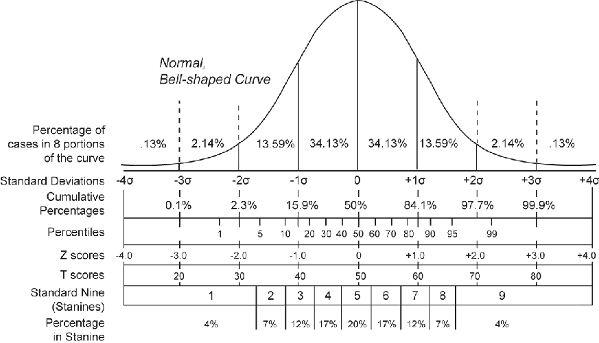

## Antes de começar
Downloads
* [Banco de dados](https://www.dropbox.com/s/yg5ah2au41zoeun/autoestima.csv) - https://www.dropbox.com/s/yg5ah2au41zoeun/autoestima.csv
* [Descrição do banco](https://www.dropbox.com/s/2lccmbyqyscdn30/descricao-banco-auto-estima.pdf) - https://www.dropbox.com/s/2lccmbyqyscdn30/descricao-banco-auto-estima.pdf

---

## Carregando o banco da aula e pacotes

```{r echo = FALSE}
dados  <- read.csv("~/Dropbox/cursos/r-psicologia/aula-4/autoestima.csv")
require(psych)
require(epicalc)
```

```
dados  <- read.csv(file.choose(), header=TRUE, sep=",")
require(ggplot2)
require(lattice)
```

---

## Resumão
* Introdução a análise inferencial
* Distribuição normal
* Erro padrão
* Intervalo de confiança

---

## Introdução a análise inferencial
* Uma das principais funções da estatística é a inferência
* A inferência estatística permite que através de uma amostra bem escolhida, conheçamos com razoável precisão a população.

---

## Distribuições
* Existem diferentes tipos de distribuições de dados (binomial, poission, normal...)
* Uma das mais utilizadas nas ciências da saúde é a distribuição normal

---

## Distribuição normal
<center>

</center>

---

## Distribuição normal
* Ex. baseado nos escores da escala de auto estima
```{r echo = TRUE}
autoMean  <- mean(dados$somaescala, na.rm = TRUE)
autoSd  <- sd(dados$somaescala, na.rm = TRUE)
x  <- 17:35
y  <- dnorm(x, mean = autoMean, sd = autoSd)

```

---

## Distribuição normal
```{r}
plot(x = x, y = y, type="l", col = "blue")
```

---

## Erro padrão
* É utilizado para identificar o quão precisa é a estimativa da média da população.
  * Ex. Simulação da população a partir dos escores da escala de auto-estima.
```{r}
simAe  <- rnorm(1000, mean = autoMean, sd = autoSd) # simulação
amostra50  <- sample(simAe, size= 50) # amostra aleatório de n = 50
amostra100  <- sample(simAe, size= 100) #amostra aleatório de n = 100
describe(simAe)
```

---

## Erro padrão (cont.)
Comparando amostras 50 vs 100
```{r}
describe(amostra50); describe(amostra100)
```

---

## Intervalo de confiança
* Informa uma estimativa do quão perto estamos do valor de uma população.
* Adota-se geralmente um grau de confiança de 95%.

---


## Intervalo de confiança para corajosos
Na mão
```{r}
se  <- sd(amostra50)/sqrt(50)
lower  <- mean(amostra50) - 1.96 * se
upper  <- mean(amostra50) + 1.96 * se
c(lower, upper)

```

---

## Intervalo de confiança para peguiçosos
Usando pacote 'epicalc'
```{r}
require(epicalc)
ci(amostra50)
```

---
