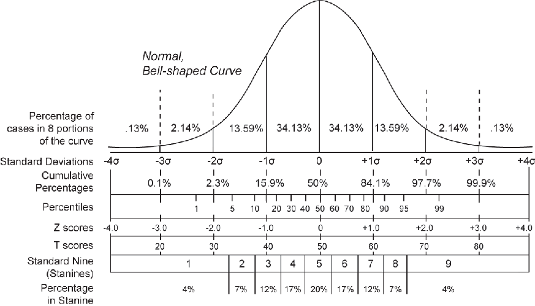

## Antes de começar
Downloads
* [Banco de dados](https://www.dropbox.com/s/yg5ah2au41zoeun/autoestima.csv) - https://www.dropbox.com/s/yg5ah2au41zoeun/autoestima.csv
* [Descrição do banco](https://www.dropbox.com/s/2lccmbyqyscdn30/descricao-banco-auto-estima.pdf) - https://www.dropbox.com/s/2lccmbyqyscdn30/descricao-banco-auto-estima.pdf

---

## Carregando o banco da aula e pacotes


```
dados  <- read.csv(file.choose(), header=TRUE, sep=",")
require(epicalc)
require(psych)

```

---

## Resumão
* Introdução a análise inferencial
* Distribuição normal
* Erro padrão
* Intervalo de confiança

---

## Introdução a análise inferencial
* Uma das principais funções da estatística é a inferência
* A inferência estatística permite que através de uma amostra bem escolhida, conheçamos com razoável precisão a população.

---

## Distribuições
* Existem diferentes tipos de distribuições de dados (binomial, poission, normal...)
* Uma das mais utilizadas nas ciências da saúde é a distribuição normal

---

## Distribuição normal
<center>

</center>

---


## Distribuição normal
* Ex. baseado nos escores da escala de auto estima

 


---


## Erro padrão
* É utilizado para identificar o quão precisa é a estimativa da média da população.
  * Ex. Simulação da população a partir dos escores da escala de auto-estima.
  

```r
simAe <- rnorm(1000, mean = autoMean, sd = autoSd)  # simulação
amostra50 <- sample(simAe, size = 50)  # amostra aleatório de n = 50
amostra100 <- sample(simAe, size = 100)  #amostra aleatório de n = 100
describe(simAe)
```

```
##   var    n  mean   sd median trimmed  mad   min   max range skew kurtosis
## 1   1 1000 26.12 2.65  26.03    26.1 2.57 18.17 34.56 16.38 0.05     0.05
##     se
## 1 0.08
```


---

## Erro padrão (cont.)
Comparando amostras 50 vs 100

```r
describe(amostra50)
```

```
##   var  n  mean   sd median trimmed  mad   min   max range  skew kurtosis
## 1   1 50 25.93 3.05  25.99   25.99 3.66 18.58 32.28 13.71 -0.16    -0.64
##     se
## 1 0.43
```

```r
describe(amostra100)
```

```
##   var   n  mean   sd median trimmed  mad  min   max range  skew kurtosis
## 1   1 100 26.38 2.67  26.28   26.39 2.43 19.3 33.44 14.13 -0.04     0.07
##     se
## 1 0.27
```


---

## Intervalo de confiança
* Informa uma estimativa do quão perto estamos do valor de uma população.
* Adota-se geralmente um grau de confiança de 95%.

---


## Intervalo de confiança para corajosos
Na mão

```r
se <- sd(amostra50)/sqrt(50)
lower <- mean(amostra50) - 1.96 * se
upper <- mean(amostra50) + 1.96 * se
c(lower, upper)
```

```
## [1] 25.08 26.77
```


---

## Intervalo de confiança para peguiçosos
Usando pacote 'epicalc'

```r
require(epicalc)
ci(amostra50)
```

```
##   n  mean    sd     se lower95ci upper95ci
##  50 25.93 3.054 0.4319     25.06      26.8
```


---
