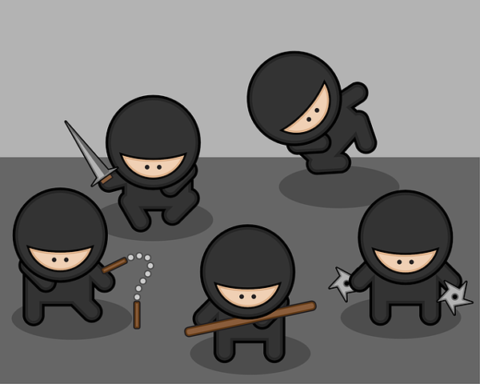
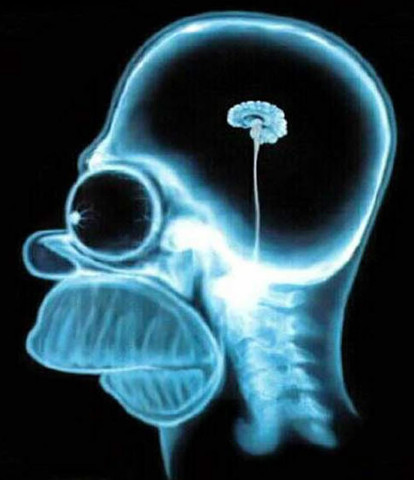

## Alerta!
1. Este curso foi desenvolvido para pessoas que saem correndo ou consideram o suicídio ao ouvir a palavra estatística. Se você trabalha com o assunto, fique a vontade para acompanhar e dar sugestões para melhorar o conteúdo.
2. Todo o material do curso é gratuito. Se nós o pegarmos vendendo este material, contaremos para sua mãe.

---

## Pequeno gafanhoto, este curso é para você se:

---

##  Você acredita que as pessoas que usam o SPSS são de marte (e deveriam morrer)

---

##  Sua alma sai do corpo ao ouvir "pesquisa quantitativa"

---

## A palavra "coleta"", significa 'exame de sangue ou fezes'

---

## Se o termo "banco de dados" significa...

---

## Se o termo "moda" significa

---

## Se sim
O curso tem como objetivos:
* Introduzir os conceitos de mensuração
* Ensinar como coletar dados através da internet
* Avaliar a qualidade dos dados
*  Calcular escores dos testes
* Análises estatísticas

---

## Aula 1 - Making off
* Um pouco de ciência e estatística
* Filosofia da ciência
* Objetivos das pesquisas em ciências da saúde
* Por que você deveria estudar estatística
* Exemplos de aplicações
* Instalando o R

---

## Aula 2 - Construindo questionários e coletando dados
* Dicas gerais
* Guia para digitação
* Salvando o trabalho
* Controle de qualidade dos dados
* Prática - Planejamento do projeto
* Prática - Criação de formulário online
* Prática - Divulgação da Pesquisa

---

## Aula 3 - Análise descritiva e inferencial
* Prática - Abrir o banco de dados
* Prática - Conferindo a qualidade dos dados
* Medidas de tendência central e dispersão
* Análise gráfica de distribuições
* Testes de hipóteses
* Intervalos de confiança

---

## Aula 4 - Estatística paramétrica e não paramétrica
* Testes estatísticos (ANOVA, teste t, correlação, associação)
* O valor p e sua maldição
* Redação do relatório de análise do projeto criado
* Encerramento

---

## Requisitos desejáveis
* Latim
* Ter filiação partidária a um partido político
* Pertencer a alguma religião
* ...

---

## Requisitos necessários
* Vontade de aprender
* Ter conta do facebook e participar do [Grupo de estatística ninja](https://www.facebook.com/groups/182743951904494/)
* Comparecer no horário do Hangout marcado - [Link para plugin](https://www.google.com/tools/dlpage/hangoutplugin)
* Instalar os programas R, RStudio e Rcommander no computador - [Link](https://www.youtube.com/watch?v=-SH3qHL2f1g)
* Fazer inscrição no formulário deste [link](https://docs.google.com/forms/d/1yOx17FrIH6SIfNZm47VveWT9Lc-46zlgtz9LnEw9hBE/viewform)

---

## Contato
henriquepgomide@gmail.com
@hpgomide

---

